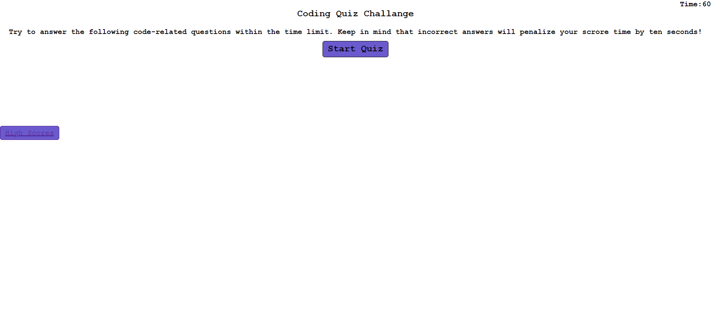
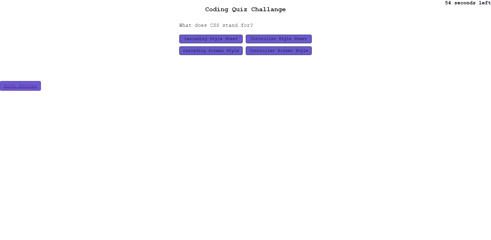

# 04-Code-Quiz
Forth assignment

## HTML + Javascript + CSS
- I created a 5 question randomized coding quiz using HTML and Javascript, mainly styled with CSS
- User will be prompted by computer to answer 5 questions 
- If user does not answer correctly, computer will return text 'You got it wrong!'and button will turn red
- If user does answer correctly, computer will return 'You got it right!' and button will turn teal
- A timer with 60 seconds will display on top right and 10 seconds will be deducted from each wrong answer
- User will input intials at end of game and score + initials will be saved

### Link to deployed application

<a href="https://lyndseyfin.github.io/04-Code-Quiz/"> Code Quiz</a>

#### Screenshot

##### License

Copyright <YEAR> <COPYRIGHT HOLDER>

Permission is hereby granted, free of charge, to any person obtaining a copy of this software and associated documentation files (the "Software"), to deal in the Software without restriction, including without limitation the rights to use, copy, modify, merge, publish, distribute, sublicense, and/or sell copies of the Software, and to permit persons to whom the Software is furnished to do so, subject to the following conditions:

The above copyright notice and this permission notice shall be included in all copies or substantial portions of the Software.

THE SOFTWARE IS PROVIDED "AS IS", WITHOUT WARRANTY OF ANY KIND, EXPRESS OR IMPLIED, INCLUDING BUT NOT LIMITED TO THE WARRANTIES OF MERCHANTABILITY, FITNESS FOR A PARTICULAR PURPOSE AND NONINFRINGEMENT. IN NO EVENT SHALL THE AUTHORS OR COPYRIGHT HOLDERS BE LIABLE FOR ANY CLAIM, DAMAGES OR OTHER LIABILITY, WHETHER IN AN ACTION OF CONTRACT, TORT OR OTHERWISE, ARISING FROM, OUT OF OR IN CONNECTION WITH THE SOFTWARE OR THE USE OR OTHER DEALINGS IN THE SOFTWARE.

