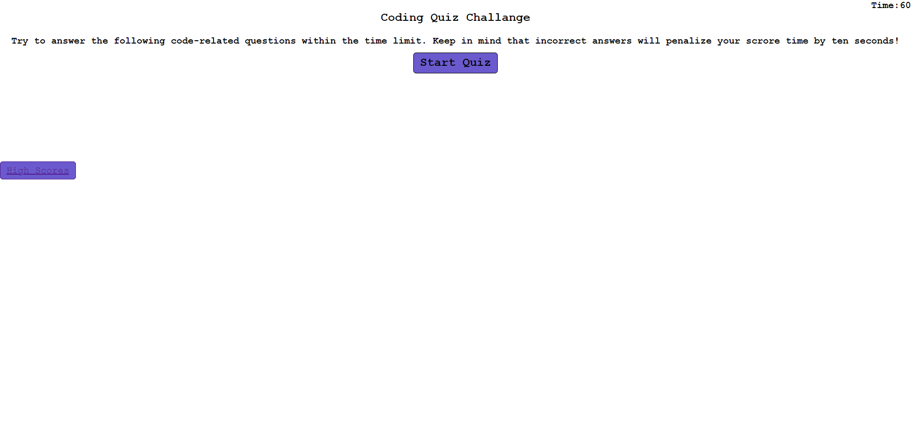

# 04-Code-Quiz
Forth assignment

## HTML + JS + CSS
- I created a randomized quiz with HTML and Javascript, mainly styled with CSS to create a randomized coding quiz with 5 questions 
- User will be prompted by computer to answer 5 questions 
- If user does not answer correctly, text will display in red and a statement of 'You are wrong!'
- If user does answer correctly, text will display in teal and return a statement of 'You are correact!'
- A timer with 60 seconds will display on top right and 10 seconds will be deducted from each wrong answer
- User will input intials at end of game and score + initials will be saved

### Link to deployed application

<a href="https://lyndseyfin.github.io/04-Code-Quiz/"> Code Quiz</a>

#### Screenshot

